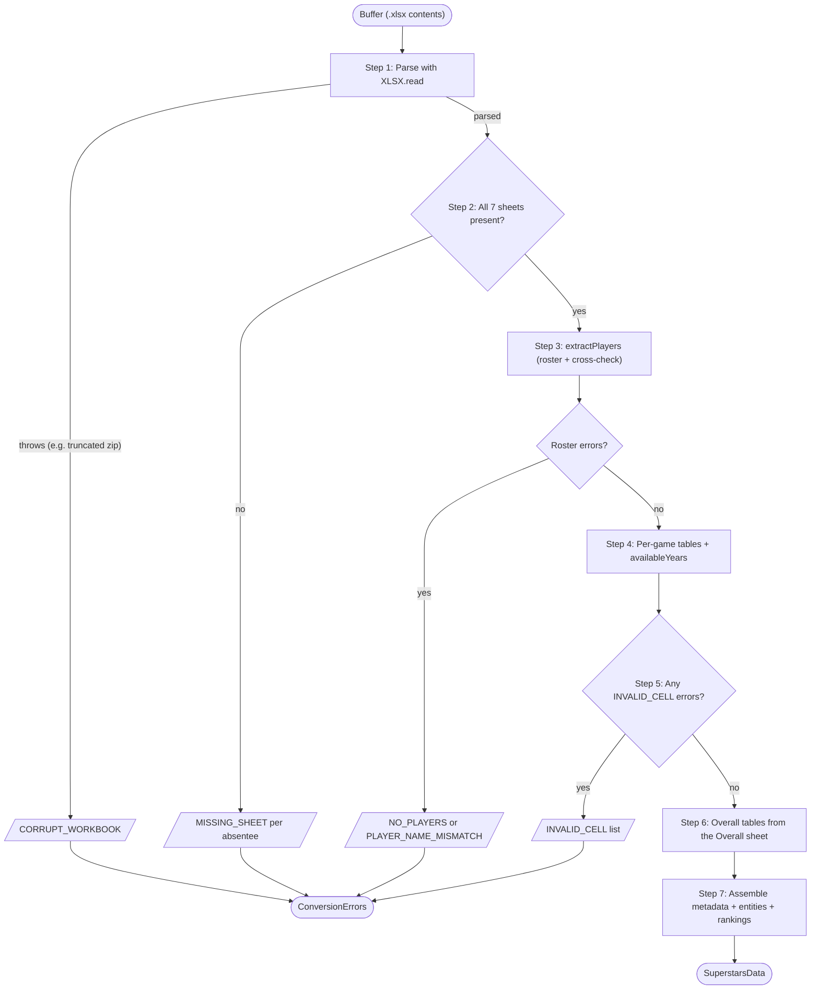
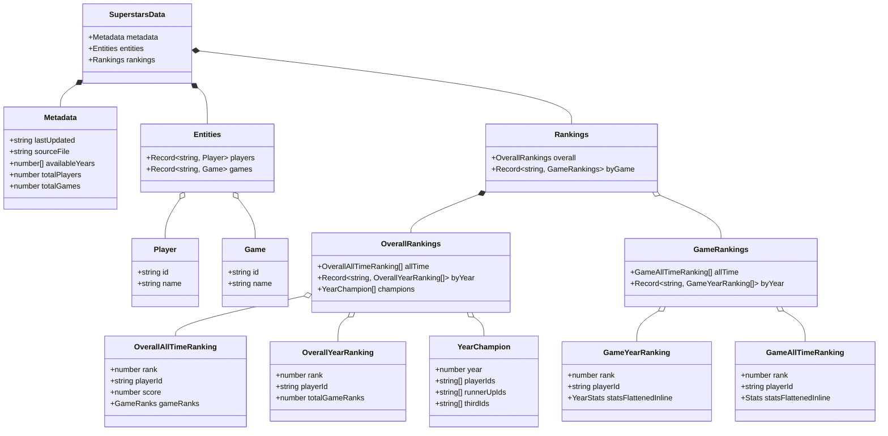

# Conversion Architecture: Spreadsheet → JSON

How `Superstars - Master Scores.xlsx` becomes `master-scores.json` (the `SuperstarsData` contract the frontend validates against).

## The one rule: verbatim mirror

The output reflects **exactly what the spreadsheet says**. Every rank, score and season total is read from the workbook's own (cached) formula results — never recomputed. If a formula in the sheet is wrong, the JSON is wrong in the same way; corrections belong in the spreadsheet, not in code (see `spreadsheet-bugs.md` for the known cases).

The only derived values are cosmetic:

- `goalDifference` falls back to `goalsFor − goalsAgainst` when the sheet's Df cell is blank.
- Darts' per-year `averagePoints` mirrors a hidden helper column the sheet itself uses.
- Cached averages are rounded to the precision the sheet displays (strips float noise like `8.8800000000000008`).

## Module layout (`lib/`)

| Module | Holds | Imports |
| --- | --- | --- |
| `enums.ts` | `GameKind`, `GameName`, `ConversionErrorCode` | nothing |
| `types.ts` | The output contract (mirrors `example-data-shape.jsonc`), error shapes + `isConversionErrors`, conversion internals, workbook-layout interfaces | enums |
| `errors.ts` | One factory per conversion error | enums, types |
| `consts.ts` | Workbook layout: player rows, year blocks, column offsets, running-totals/Overall columns, `GAME_DEFINITIONS` | enums, types |
| `utils.ts` | Cell readers + `round`/`columnOffset` | errors, types |
| `convertMasterScores.ts` | Extraction, table builders, entry point | all of the above |

## Workbook layout

- **Players** sit on rows 7–22 of every sheet (names in column A); ids `p_1..p_n` are assigned in row order. Game ids `g_1..g_6` follow `GAME_DEFINITIONS` order.
- **Year blocks**: each game sheet repeats an identical column block per season, 2020–2030 (start columns `D, O, Z, AK, AV, BG, BR, CC, CN, CY, DJ`). Within a block: played (+0), wins (+1), first score column (+3), second score column (+4), the sheet's computed rank (+7). Future years appear in the output automatically once they contain data.
- **Running Totals** (all-time) per game sheet: columns GO–GV.
- **Overall sheet**: numeric all-time game ranks in GE–GJ, score in GK, rank in GL; per-season totals in KY–LI paired with numeric ranks in LO–LY (index-aligned with the year blocks).

## The pipeline (`convertMasterScoresToJson`)

1. **Parse** the buffer. SheetJS only throws on structurally broken files → `CORRUPT_WORKBOOK`. Garbage it half-parses as CSV is caught by step 2 instead.
2. **Require all seven sheets** (six games + Overall) → `MISSING_SHEET` per absentee.
3. **Roster**: read names from the first game sheet, cross-check every other sheet row-by-row (`PLAYER_NAME_MISMATCH`, `NO_PLAYERS`). First error checkpoint — roster problems make all later tables unsafe.
4. **Per-game tables**: extract raw year-block stats, build `byYear` (rows shaped by `GameKind`) and `allTime` (read from Running Totals). `availableYears` falls out of this pass.
5. **Second error checkpoint**: extraction may have accumulated `INVALID_CELL` reports (non-numeric raw stat cells are fatal, never silently zeroed).
6. **Overall tables**: season tables and all-time standings read straight from the Overall sheet; champions are derived from the season tables (the only table not read from a sheet).
7. **Assemble** metadata + entities + rankings and return.

Every early-exit error path returns rather than throws.

## Reading cells: two levels of trust

- **Raw stat cells** (played/wins/scores) use the strict reader: a present but non-numeric value is a data problem → `INVALID_CELL`, and the conversion fails loudly.
- **Computed cells** (ranks, totals, scores) use lenient readers: `#VALUE!` errors and markers like `"A"` are the sheet's way of saying *absent*, so the row is simply omitted — exactly as the sheet displays nothing for it. Rank cells accept numbers or ordinals (`"4th"` → `4`).

## Error contract

`convertMasterScoresToJson(buffer)` returns `SuperstarsData | ConversionErrors` — it never throws. All detectable problems are accumulated and returned together so the client can render a complete error screen. Discriminate with `isConversionErrors()`.

## Output contract

The `SuperstarsData` shape the frontend validates against. Ranking rows are flat — the stat fields sit alongside `rank`/`playerId`, with the shape varying by game kind.

## Testing

`convertMasterScores.test.ts` builds miniature synthetic workbooks with the real layout (SheetJS in-memory), covering each game's row shape, tie handling, verbatim-rank mirroring (including a test that plants a deliberately wrong rank and asserts it is *not* corrected), absent-marker handling, and every `ConversionErrorCode`. Run with `npm test`; regenerate the JSON with `npm run convert`.
